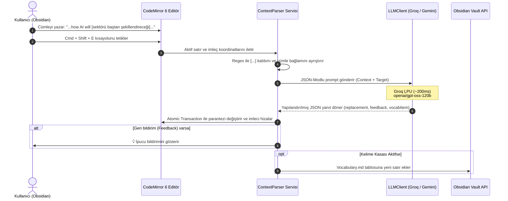

# 🌉 Obsidian Fluency Bridge — Sürüm Notları (v0.1.0 MVP)

> **Yayın Tarihi:** Ekim 2026  
> **Sürüm:** `v0.1.0` (İlk Kararlı MVP Sürümü)  
> **Geliştirici:** Yusuf Erkam Özyer  
> **Durum:** Canlı / Kullanıma Hazır

---

## 📖 1. Giriş ve Çözülen Problem

İkinci bir dilde (özellikle İngilizce) akademik not, teknik dokümantasyon veya düşünce günlüğü tutarken zihnin en büyük düşmanı **"akışın bozulmasıdır" (flow-state interruption)**. 

Bir kelime veya deyim akla gelmediğinde tarayıcıya geçip Google Translate ya da sözlük açmak:
1. Düşünce zincirini dağıtır ve odağı öldürür.
2. Bakılan kelimeler o notun içinde kaybolur; aktif kelime haznesine (Active Vocabulary) katılamadan unutulur.
3. Birebir (literal) çeviriler yüzünden cümlenin genel akışına uymayan veya yapay duran kalıplar oluşur.

**Fluency Bridge v0.1.0**, klavyeden elinizi kaldırmadan ve editörden hiç çıkmadan bu engelleri aşmak için tasarlandı.

---

## ⚡ 2. Neler Yapıyor? (Temel Yetenekler)

### A. Akış İçi Bağlamsal Dönüştürme (In-Flow Replacement)
- İngilizce yazarken takıldığınız kelimeyi veya yarım kalmış ifadeyi Türkçe olarak `[köşeli parantez]` içine yazarsınız.
- `Cmd + Shift + E` (Windows'ta `Ctrl + Shift + E`) kısayoluna bastığınız anda parantez içindeki ifade silinir; yerine **cümlenizin gramerine, tonuna ve bağlamına en uygun doğal İngilizce karşılık** yerleştirilir.
- İmleç otomatik olarak yeni eklenen ifadenin hemen sağına konumlanır; yazmaya kesintisiz devam edebilirsiniz.

### B. Yazım ve Doğallık Önerileri (Fluency & Nuance Coaching)
- Bir denetçi veya bekçi dili yerine, yapıcı bir **"Yazım Danışmanı"** gibi davranır.
- Yazdığınız cümlenin tamamını tarar:
  - Gözden kaçan yazım hataları (typo) varsa (örn. *hearth* yerine *heart*),
  - Yerli dilde kulağa daha doğal gelen bir kalıp/eşdizim varsa (örn. *make research* yerine *do research*),
  - Ekranda nazik bir `💡 İpucu: ...` bildirimi göstererek sizi bilgilendirir.
- Eğer cümleniz zaten akıcı ve hatasızsa dikkatinizi dağıtmaz, sessizce sadece çeviriyi yapar.

### C. Otomatik Aktif Kelime Kasası (Active Vocabulary Deck)
- Öğrenilen her yeni kelime/deyim, kasanızdaki `Vocabulary.md` dosyasına otomatik olarak işlenir.
- Kaydedilen bilgiler:
  - **Tarih & Saat**
  - **Hedef İfade (Bold)**
  - **Türkçe Anlamı & Bağlamsal Not**
  - **Kullanıcının Yazdığı Gerçek Örnek Cümle**
- Böylece kendi cümlelerinizden oluşan kişisel bir Spaced Repetition (SRS) veri tabanı kendiliğinden oluşur.

---

## 🛠️ 3. Nasıl Yapıyor? (Teknik Mimari & Çalışma Mekanizması)

### 1. Editör Katmanı (CodeMirror 6 Entegrasyonu)
- `src/services/contextParser.ts` modülü, Obsidian'ın yerel CodeMirror 6 editör API'sini kullanır.
- İmlecin bulunduğu satırdaki `\[([^\]]+)\]` kalıbını analiz eder. 
- İster parantez içinde olun, ister parantezin hemen yanında, en yakın hedefi milisaniyeler içinde yakalar.
- Kullanıcı dilerse parantez kullanmadan fareyle herhangi bir kelime grubunu seçerek de aynı komutu çalıştırabilir.

### 2. Yüksek Hızlı Çıkarım Motoru (LLM Client)
- `src/llm/client.ts`, harici ağır SDK'lara bağımlı kalmadan saf `fetch` ile OpenAI standart REST arayüzünü kullanır.
- **Varsayılan Sağlayıcı: GroqCloud LPU.**
  - Model: `openai/gpt-oss-120b` (120 Milyar parametrelik derin akıl yürütme modeli).
  - Alternatif: `qwen/qwen3.8-27b` (Sadece 70 milisaniyelik anlık yanıt).
- `response_format: { type: "json_object" }` zorlamasıyla deterministik, JSON şemalı ve hatasız veri alışverişi sağlanır.

### 3. Atomik Editör Değişimi & İmleç Koruma
- Gelen yanıt Obsidian editörüne `editor.replaceRange` ile tek bir atomik işlemle uygulanır.
- Böylece `Cmd + Z` (Undo) yapıldığında kullanıcı tek adımda orijinal haline geri dönebilir.
- İmleç kaybolmaz; yeni ifadenin son karakterine yerleştirilerek yazma akışı devam ettirilir.

### 4. Vault Dosya Sistemi Yönetimi
- `src/services/vocabulary.ts`, `app.vault.adapter` üzerinden çalışır.
- Belirtilen klasör veya `Vocabulary.md` dosyası henüz yoksa, Markdown tablo başlıklarıyla birlikte otomatik üretilir. Varsa doğrudan dosyanın sonuna yeni satır olarak iliştirilir (append).

---

## 📋 4. Sürüm v0.1.0 Özeti & Konfigürasyon

| Özellik | Durum / Değer |
| :--- | :--- |
| **Kısayol Tuşu** | `Cmd + Shift + E` (Mac) / `Ctrl + Shift + E` (Win/Linux) |
| **Desteklenen Sağlayıcılar** | Groq (Önerilen), Google Gemini, OpenRouter, Local Ollama |
| **Varsayılan Model** | `openai/gpt-oss-120b` (Groq üzerinde ücretsiz) |
| **Ortalama Gecikme** | ~200ms – 400ms (Akışı kesmeyecek seviyede) |
| **Kelime Kütüğü** | Kasa kök dizininde `Vocabulary.md` |
| **Bundle Boyutu** | ~20 KB (Ultra hafif, sıfır çalışma zamanı yükü) |

---

## 🔮 5. Gelecek Sürümler (Yol Haritası)

- [ ] **v0.2.0:** AnkiConnect yerel REST API entegrasyonu (Tek tıkla doğrudan Anki destesine kart basma).
- [ ] **v0.3.0:** Çoklu alternatif seçimi (İfade üzerinde mini bir açılır menü ile 2-3 alternatif arasından seçim yapabilme).
- [ ] **v0.4.0:** Tamamen internetsiz ortamlar için yerel ONNX / Ollama arka plan otomasyonu.
